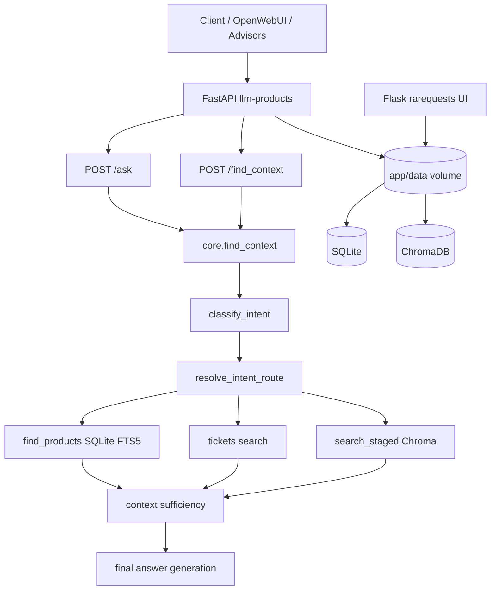

# RAG Server

Python
FastAPI
Docker

Production RAG backend for a marketplace assistant: product catalog search, support tickets, knowledge-base manuals, recipes, and SEO articles — with intent-aware routing, staged retrieval, and early exit.

## Features

- **Intent routing** — LLM classifier over 7 domain intents plus a safe `undefined` fallback; configurable stage order (`products` → `tickets` → `files`) via `app/config/intent_routes.json`
- **Staged retrieval with early exit** — multi-source context assembly (products, tickets, files) with a sufficiency judge; stops when enough context is found
- **Products search pipeline** — NER (`parse_query`), regex/probe SKU lookup, SQLite FTS5, product-schema lookup, manufacturer bypass, tiered context cap (`PRODUCTS_CONTEXT_MAX`)
- **Knowledge-base file retrieval** — Chroma `files` collection; SKU hard-select, token overlap, composite rerank for `knowledge_base`* manuals (`source=tm_knowledge_base`)
- **Quality and observability** — `rarequests` request logging in SQLite, CSV autotests, golden regression scripts, `undefined_intents.log` for low-confidence routing
- **Integrations** — Advisors 2.0 direct contract (`POST /find_context`); OpenWebUI tool/filter path kept for compatibility

## Architecture

### Request flow (summary)

1. `**classify_intent**` — structured LLM output (`intent_label`, `confidence`); below threshold → `undefined`
2. `**resolve_intent_route**` — picks stage order from `intent_routes.json`; unknown intent → `fallback_default`
3. `**parse_query**` (NER) — runs once per request when products or files stages are needed; regex SKUs merged into `product_names`
4. **Retrieval stages** — `find_products` (SQLite + FTS5), ticket vector search, `search_staged` (Chroma: `files`, `seocrm_article`, `recipe`)
5. **Early exit** — when context is sufficient, later stages are skipped
6. `**/ask` only** — final LLM answer generation on top of assembled context

## Repository layout

| Path                 | Description                                                                                        |
| -------------------- | -------------------------------------------------------------------------------------------------- |
| `app/`               | FastAPI core: `main.py`, `core.py`, `llm_funcs.py`, intent modules, routes, tests                  |
| `app/data/`          | Runtime volume (SQLite, Chroma, logs, test CSVs) — mounted at `/app/data`, **not** in Docker build |
|                      |                                                                                                    |
| `docker-compose.yml` | `llm-products` (port 8000) + `rarequests` (port 5000)                                              |
| `Dockerfile`         | Poetry install, uvicorn with **1 worker** (required for Chroma persistent storage)                 |

## API overview

### Core endpoints

| Method | Path            | Description                                                      |
| ------ | --------------- | ---------------------------------------------------------------- |
| `POST` | `/ask`          | Full RAG: retrieve context + generate answer (`AskResponse`)     |
| `POST` | `/find_context` | Retrieval only; returns `RelatedContext` (Advisors 2.0 contract) |
| `GET`  | `/health`       | Health check                                                     |

`**/find_context` query parameters** (main ones): `query`, `prompt`, `source`, `products_search_enabled`, `tickets_search_amount`, `tickets_search_threshold`, `files_search_amount`, `files_search_threshold`. Optional JSON body: `llm_model_stages`, `conversation_log`, `display_query`.

`**/ask` additional parameters**: `debug` (persists aiRAG metrics to `rarequests`), `llm_model_stages` (per-stage model overrides: `ner`, `related_products`, `summarization`, `final_answer`).

### Resource routers

| Prefix        | Key endpoints                                                                                                                                 |
| ------------- | --------------------------------------------------------------------------------------------------------------------------------------------- |
| `/products`   | `GET /search`, `POST /create`, `POST /edit`, `DELETE /delete`, `GET /get`, `GET /list_all`                                                    |
| `/tickets`    | Ticket vector search and CRUD                                                                                                                 |
| `/files`      | `POST /add` (multipart ingest), `POST /addtem` (text), `GET /search`, `GET /search_staged`, `DELETE /delete`, `POST /backup`, `POST /restore` |
| `/rarequests` | Access to logged RAG requests                                                                                                                 |

Knowledge-base ingest: `POST /files/add` with `metadata.source=tm_knowledge_base` and `data_type=files`.

## Intent routing

Configured in `app/config/intent_routes.json`. On `undefined` or low confidence, `fallback_default` applies (products → tickets → files).

| Intent                   | Route                  | Typical use                      |
| ------------------------ | ---------------------- | -------------------------------- |
| `product_specs_price`    | `products_first`       | Model, price, specs, comparison  |
| `product_recommendation` | `products_seocrm`      | Product pick by criteria         |
| `malfunction_howto`      | `tickets_first`        | Errors, troubleshooting          |
| `service_policy`         | `service_policy_route` | Warranty, delivery, payment      |
| `manual_usage`           | `manuals_first`        | How to use, manuals (no recipes) |
| `recipe_cooking`         | `recipe_first`         | Recipes and cooking ideas        |
| `meta_catalog`           | `meta_products_files`  | Questions about catalog contents |
| `undefined` / unknown    | `fallback_default`     | Safe baseline pipeline           |

Within the `files` stage, routes can override `files_data_type_order` (e.g. `recipe` → `seocrm_article` → `files` for cooking queries).

## Tech stack

- **Backend**: Python 3.12, FastAPI, Flask (rarequests)
- **LLM / RAG**: LangChain, OpenAI-compatible APIs, xAI, structured output (Pydantic)
- **Storage**: SQLite (products, logs), ChromaDB (files, tickets embeddings)
- **Search**: FTS5 (products), vector similarity + composite rerank (files)
- **Infra**: Docker, Poetry, nginx (production)

## Changelog

See [CHANGELOG.md](CHANGELOG.md) for release history.